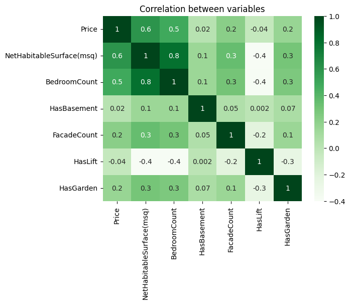
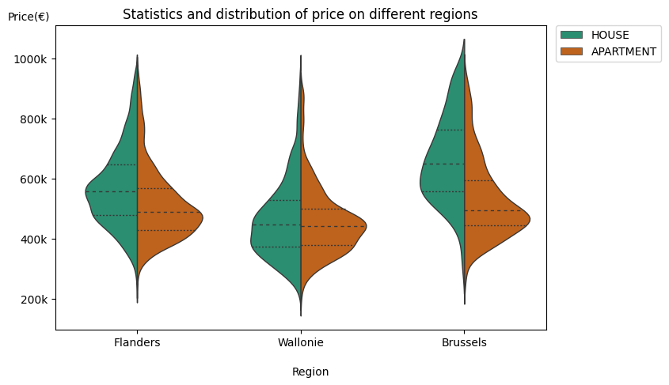
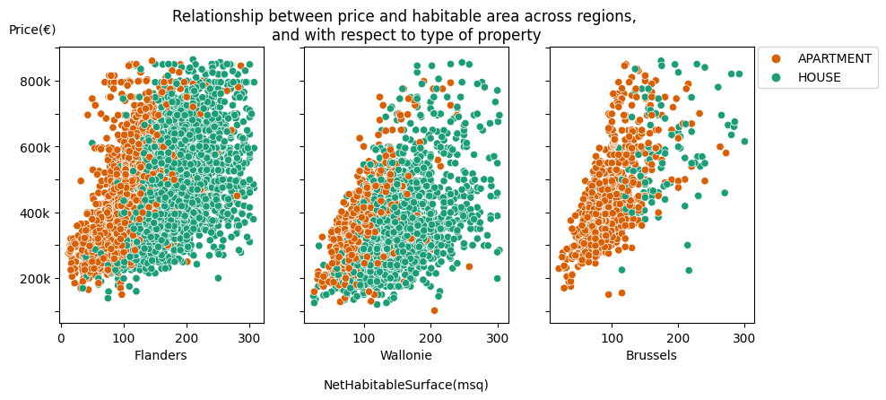
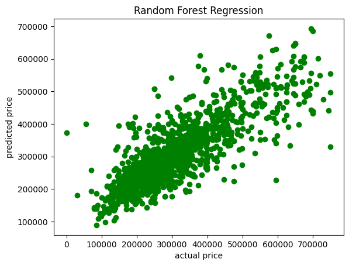

# real-estate-price-prediction
This project predicts the prices of house or apartment in Belgium based on current prices on the market. To collect the current prices of properties I have used IMMOWEB, the Belgian bigest site to sell or buy houses. The project has four main parts that are pipelined to make the final project.
The first part is data acquisition part, second the data cleaning and preprocessing part, the third part is the machine learning
part and the last one is the test and deployment part.

* Data acquisition part

	The data acquisition part is the part which collects prices and all other information of properties by scraping the immoweb.
	To extract all the links of the properties to scraped, I have used sitemap file and beautifulsoup. And after getiing all the links, 
	I have collected all the necessary information of the property from all the links and then stored in a file(CSV).

* Data analysis part
    
	The data analysis part contains all the work of data cleaning and analysis. The data gathered in the first part of the project be first cleaned the unwanted columns and rows based on the information and they contain to further analyse the data. After removing all the unwanted columns and rows, missing values are then inserted based on the type of the data. Categorical data NAN values be inputed with either 'Unknown' or most frequent values. For numerical data types mean values first calculated and then inserted to missing values. After cleaning data and inserting to missing values, analysis has been done through different plots. correlation between price and other properties have been checked to see their effect on the price. Statistics and distribution of prices over different regions has been shown and more.

	
	<p float="left">
	   
	  
          
    </p>
	
* Model creation

   The model creation part, I start with organizing the data so that it is suitable for machine learning models. Categorical values are encoded(binaryencoding and onehot encoding), numerical values are standardized. After making the data ready for the model, I have tried linear regression model and random forest regressor. Random forest regressor is then choosed as it outperforms linear regression model with r2 accuracy of65% for all the properties(houses and apartments). The model also scores 69% accuracy when applied only on the apartments and 58% for houses only(it could probably be from very low number of housed compared to apartment).
   
   <p float="left">
	     
    </p>
	
	
* Deployment

   The model is deployed using flask and docker, which is running on local machine at the moment. The deployment started with generating persistent object of a model by using pickle(model.pkl) and this model object is called in flask application to make the prediction. Then docker file is made to create the docker image.
 

## Prerequisites
 
If docker is used all requred libraries will be handled by docker. If app.py is used NumPy, Pandas, matplotlib and scikit-learn and python 3.10 are requred.
 
 
## Usage
Crate docker image from docker file and run the docker image to use the application. 
It can also be used by running app.py in the deployment folder.
	```
	> python3 /deployment/app.py 

	OR

	> python /deployment/app.py 

	OR

	> py /deployment/app.py 		
	```
      
 
## Input
 
Input should be given in a python dictionary format as the example bellow:
	  
	[{"Type": "APATMENT", "Sub type":"MIXED_USE_BUILDING","NetHabitableSurface(msq)":1100, "BedroomCount":3, "Province":"Liège", "locality":"Liege", "Region":"Wallonie", "PostCode":"4020", "HasBasement":"TRUE", "BuildingCondition":"GOOD","FacadeCount":3, "HasLift":"False", "FloodZoneType":"NON_FLOOD_ZONE", "HeatingType":"GAS", "IsDoubleGlaze":"TRUE", "HasGarden":"False", "KitchekType":"HYPER_EQUIPPED", "BuildingAge":90}]
 
## Output
  
Output is json format like this:
	  
	{"prediction": 435851.78571428574}
		
		
		
## License

Free license

## Contact

Genet Abay Shiferaw: genetabay.s@gmail.com

Repository link : https://github.com/Genet-Abay/real-estate-price-prediction

## Acknowledgments

BeCode Arai4 AI coaches(Chrysanthi and Louis)